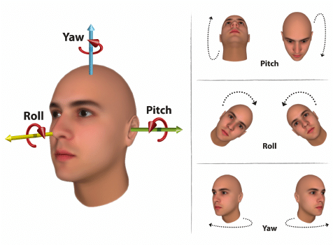

# Face Pose Estimation Application

This project is a **Face Pose Estimation** application that utilizes **Mediapipe**, **PyQt5**, and **Machine Learning models** to detect and predict head pose in images and videos. The application provides a graphical user interface (GUI) to analyze face poses using two models based on facial landmarks.

## Features

- **Pose Estimation:** Predicts head pose angles (Yaw, Pitch, Roll) using two different machine learning models.
- **Image and Video Processing:** Supports pose estimation for uploaded images and videos.
- **Real-time Webcam Support:** Live face pose estimation using a webcam.
- **Visualization:** Draws pose axes on detected faces.
- **User-friendly GUI:** Built with PyQt5 for an intuitive user experience.
- **Model Selection:** Choose between two pre-trained models for pose estimation.

## Installation

### Prerequisites
Ensure you have the following dependencies installed:

- Python 3.8+
- OpenCV
- Mediapipe
- PyQt5
- Scikit-learn
- Pandas
- Numpy
- Matplotlib
- Seaborn

### Installation Steps

1. Clone the repository:


2. Install the required packages:
   
3. Ensure the pre-trained models are placed in the `models/` directory:
   ```
   models/
   ├── model.pkl       # 7-landmark model
   ├── SVR_model.sav   # 468-landmark model
   ```

4. Run the application:
   ```bash
   python pose_estimation_app.py
   ```

## Usage

1. **Upload an Image or Video:** Click the "Upload Image" or "Upload Video" button to analyze pose.
2. **Real-time Webcam:** Use the "Start Webcam" button for live pose estimation.
3. **Model Selection:** Choose between `Model A` (7 landmarks) and `Model B` (468 landmarks).
4. **View Results:** Predicted yaw, pitch, and roll values will be displayed in the GUI, along with directional feedback.
5. **Exit Application:** Click the "Exit" button to close the application.

## Face Pose Estimation Angles

The application estimates the following angles:

- **Yaw:** Horizontal movement (left-right).
- **Pitch:** Vertical movement (up-down).
- **Roll:** Tilt (head tilt left-right).

### Interpretation of Angles

- **Yaw < -0.3:** Looking Left  
- **Yaw > 0.3:** Looking Right  
- **Pitch < -0.3:** Looking Upward  
- **Pitch > 0.3:** Looking Downward  
- **Roll < -0.3:** Head Tilted Left  
- **Roll > 0.3:** Head Tilted Right  

## Project Structure

```
face-pose-estimation/
├── models/                      # Pretrained model files
│   ├── model.pkl
│   ├── SVR_model.sav
├── pose_estimation_app.py        # Main application script
├── README.md                     # Project documentation

```
## Known Issues

- Model loading errors if paths are incorrect. Update model paths in `pose_estimation_app.py`.
- Webcam might not work if another application is using the camera.

## Future Improvements

- Support for multiple face detection.
- Integration with deep learning models for improved accuracy.
- Additional pre-processing techniques for better landmark extraction.


## License

This project is licensed under the MIT License.

